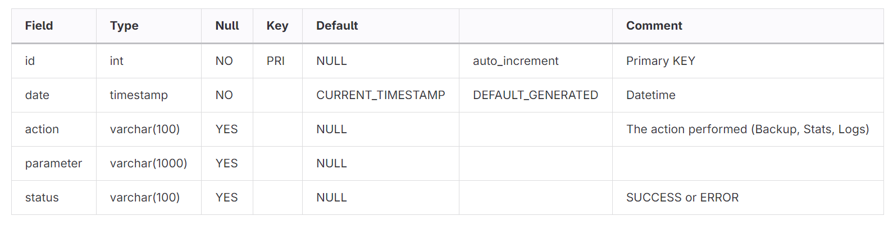

# FCA-Flask
Project used during training bootcamp at FCA.

<!-- TOC -->
* [FCA Flask Project](#FCA-Flask)
  * [Introduction](#introduction)
  * [Risks](#risks)
  * [Part 1](#part1)
    * [Database](#database)
    * [Flask](#flask)
  * [Part 2](#part2)
    * [Docker](#docker)
    * [Nexus](#nexus)
    * [Jenkins](#jenkins)
<!-- TOC -->

## Introduction
The goal of this project was to build a simple flask application that could backup files and store logs of it's actions in a database. The application was then containerised, stored in a private Nexus repository and automated using Jenkins.

## Workflow Tracking
The progress of this project was tracked using user stories on a Kanban board hosted in [Trello](https://trello.com/b/gcykprBE/fcaprojectboard).

## Risks
| Risk | Impact | Mitigation |
|:------:|:--------:|:------------:|
| Docker Lacks Resources | High: The project may be unable to run if Docker cannot get the resources it needs. | Provide additional resources, end programs or services using resources or move to a different machine. |
| Database Connection Failed | Moderate: The project will not be able to store logs. | Check that the MySQL container is connected to your docker network and the IP details in the code match.   Alternatively, run a local MySQL server. |
| Unable to Connect or Push to Nexus | Moderate: The updated image will not be stored safely in a repository. | Ensure that the correct credentials have been created within Jenkins.    Check that Nexus is accessible on the expected IP and port. |
| Buggy or Broken Code | High: Program may show unexpected behaviour or crash with errors. | Perform regular testing and debugging of the code throughout the project to try to catch at many bugs as possible before release. |
| Jenkins Can't Run Batch Commands | Moderate: The program's automation will not work and all steps will have to be performed manually. | Ensure that the Jenkins installation is running on a Windows machine.    Modify the Jenkins script to run as a bash script instead. |
| Security Risks | High: A malicious user may be able to connect to the database behind the application and steal personal information. | The database's credentials should not be hardcoded, and should be securely stored as secrets somewhere and ideally encrypted.    The application should also be redeveloped to use HTTPS requests and other forms of encryption to ensure users are valid.    Setting up a user database so only approved and authenticated users can backup files would also be a good idea. |

## Part 1
Part one of this project consisted of creating a Flask application with Python that was able to backup files and folders as well as logging it's actions.

### Database
A MySQL relational database was used for this project, with a single table, logs, in a database named FCA used to store these logs. The table had the following structure:  
  

This structure was created by entering the following commands in the MySQL shell:  
`CREATE DATABASE fca;`  
`USE fca;`  
`CREATE TABLE log(id        INT PRIMARY KEY AUTO_INCREMENT,date      TIMESTAMP NOT NULL DEFAULT CURRENT_TIMESTAMP,action    VARCHAR(100),parameter VARCHAR(1000),status    VARCHAR(100));`

### Flask
Three files were created, one to run the main flask application and handle the routes, one to handle the actual backing up of the folders and files and a final one to connect to the database and handle the logging.
Currently the connection to the MySQL database is hardcoded, a future improvement would be to ask the user for the Database ID, port and credentials when first running the application.  

  
The app.py file handles the routes of the Flask application, calling the other functions when it receives the appropriate HTTP requests and returning the JSON responses.
The redirect to the /backup route currently doesn't work, as the method is changed and I'm not certain if the headers work correctly after the redirect.  

  
The backup.py file contains a single function which handles the backing up of both folders and files to a local directory.
Although it can handle both folders and files, currently it only backs up to a hardcoded local directory to the script. A future improvement might be to allow the user to specify their backup directory.  

  
Finally, the data.py file contains several functions to handle connecting to the MySQL database and storing logs of all interactions from users with the program.
Currently, the IP, port, username and password for the database are all hardcoded, which is a security risk. In the future, users should be able to specify their own database's IP and port, and the username and password for the database should be
securely stored as secrets.

## Part 2
In this part of the project, the completed application was containerised and automated. The application was split into two containers, one to run the application itself and one to store the logs in a MySQL database.

### Docker
First, the Python backup program was containerised. This was achieved by creating a Dockerfile that installed all of the required dependencies using Pip and then ran the app.py main file of the project using python on port 5000. 
This dockerfile installed the dependencies for the program using Pip and then exposed port 5000 in the container to make the Flask application accessible.  
  
A standard MySQL container was also created using the official image on docker hub, running on port 3306. Once it was running, this container was entered with the command `docker exec -it mysql /bin/bash`. This provided a bash
terminal on the container from which the MySQL server could be accessed and the required database and table for the application was created as seen in part 1.  
  
Once the project was initialised, I tested it in two ways, first by confirming that the Flask application was running and receiving requests using my browser. The 'Method Not Allowed' error was expected here, as the program only
accepts POST requests to the /backup route and not the GET request my browser sent.  
  
Finally, I sent some correctly formatted requests to ensure that I saw the expected results and the program was working as intended. I achieved this by sending the appropriate requests using the Git Bash shell and confirming that
I received the JSON response expected by my code.  
  
### Nexus
Nexus was used to host the created images in a private repository, as well as to provide a proxy to the Docker hub. Rather than running as a native application, a containerised version of Nexus was used.
Within this container, the Docker proxy was set up with the following configuration:  
  
This allowed the user to pull images from Docker that were not stored on the local machine via their Nexus repository manager.  
Additionally, a secured private Docker repository was created within Nexus to allow the user to store created images securely on a repository they or their organisation manage:  
  
This meant that it was not necessary to rely on a third party or public service such as Docker hub to store our application's Docker image.
Once it was confirmed that the application worked as intended I pushed my created image to the private Nexus repository.  
  
### Jenkins
Finally, Jenkins was used to automate the running of the project. This included building the image, pushing the completed image to Nexus, running the image and connecting the image to a Docker network.  
  
This was created as a docker pipeline within Jenkins with the appropriate Docker plugins installed beforehand and was running based on a Jenkinsfile stored in an external repository (this Github repository).  
  
The Jenkins pipeline had three stages. In the build stage, the Docker image for the application is created and tagged with 'latest' to identify that this is the most recent build.
In the push stage, the pipeline logs into the private Nexus repository and uploads the tagged Docker image. For security purposes, the credential capabilities of Nexus have been used, rather than hardcoding the credentials.
New users will need to create these credentials in their Nexus installation and ensure that the pipeline can access the credentials as needed. Finally, in the deploy stage, the image is used to run a containerised version
of the application on port 8085 on the host. This port was chosen to avoid conflicts with the existing containers used by the program. The running image is then connected to a Docker network to allow communication between
the application's container and the database container. Finally, if all commands of the pipeline ran successfully, the pipeline prints a success message to the console.

> :warning: **If you are on a Linux machine**: This Jenkins pipeline was created on a Windows install of Jenkins. It will need to be adapted to work on Linux. At the very least, the 'bat' proceeding each command should be replaced with 'sh'.