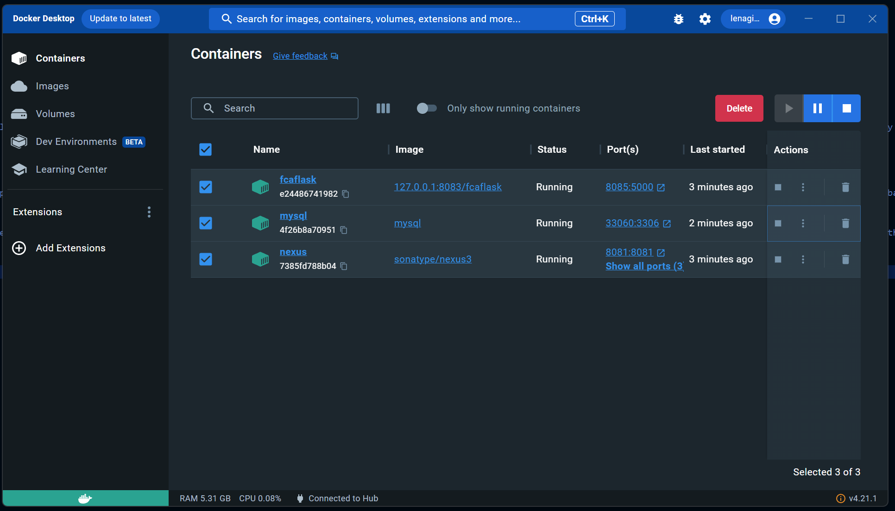

# FCA-Flask
Project used during training bootcamp at FCA.

<!-- TOC -->
* [FCA Flask Project](#FCA-Flask)
  * [Introduction](#introduction)
  * [Risks](#risks)
  * [Part 1](#part1)
    * [Database](#database)
    * [Flask](#flask)
  * [Part 2](#part2)
    * [Docker](#docker)
    * [Nexus](#nexus)
    * [Jenkins](#jenkins)
<!-- TOC -->

## Introduction
The goal of this project was to build a simple flask application that could backup files and store logs of it's actions in a database. The application was then containerised, stored in a private Nexus repository and automated using Jenkins.

## Workflow Tracking
The progress of this project was tracked using user stories on a Kanban board hosted in [Trello](https://trello.com/b/gcykprBE/fcaprojectboard).

## Risks
| Risk | Impact | Mitigation |
|:------:|:--------:|:------------:|
| Docker Lacks Resources | High: The project may be unable to run if Docker cannot get the resources it needs. | Provide additional resources, end programs or services using resources or move to a different machine. |
| Database Connection Failed | Moderate: The project will not be able to store logs. | Check that the MySQL container is connected to your docker network and the IP details in the code match.   Alternatively, run a local MySQL server. |
| Unable to Connect or Push to Nexus | Moderate: The updated image will not be stored safely in a repository. | Ensure that the correct credentials have been created within Jenkins.    Check that Nexus is accessible on the expected IP and port. |

## Part 1
Part one of this project consisted of creating a Flask application with Python that was able to backup files and folders as well as logging it's actions.

### Database
A MySQL relational database was used for this project, with a single table, logs, in a database named FCA used to store these logs. The table had the following structure:
[ ](./docs/images/database.png)  

This structure was created by entering the following commands in the MySQL shell:  
`CREATE DATABASE fca;`  
`USE fca;`  
`CREATE TABLE log(id        INT PRIMARY KEY AUTO_INCREMENT,date      TIMESTAMP NOT NULL DEFAULT CURRENT_TIMESTAMP,action    VARCHAR(100),parameter VARCHAR(1000),status    VARCHAR(100));`

### Flask
Three files were created, one to run the main flask application and handle the routes, one to handle the actual backing up of the folders and files and a final one to connect to the database and handle the logging.
Currently the connection to the MySQL database is hardcoded, a future improvement would be to ask the user for the Database ID, port and credentials when first running the application.

## Part 2
In this part of the project, the completed application was containerised and automated. The application was split into two containers, one to run the application itself and one to store the logs in a MySQL database.

### Docker
First, the Python backup program was containerised. This was achieved by creating a Dockerfile that installed all of the required dependencies using Pip and then ran the app.py main file of the project using python on port 5000. 
A standard MySQL container was also created using the official image on docker hub, running on port 3306. Once it was running, this container was entered with the command `docker exec -it mysql /bin/bash`. This provided a bash
terminal on the container from which the MySQL server could be accessed and the database was initialised as in part 1.
[ ](./docs/images/docker.png)  
Once the project was initialised, I tested it in two ways, first by confirming that the lask application was running and receiving requests using my browser.
[ ](./docs/images/flask-running.png)  
Finally, I sent some correctly formatted requests to ensure that I saw the expected results and the program was working as intended.
[ ](./docs/images/flask-success.png)  
### Nexus
Nexus was used to host the created images in a private repository, as well as to provide a proxy to the Docker hub. Rather than running as a native application, a containerised version of Nexus was used.
Once it was confirmed that the application worked above, I pushed my created image to the Nexus repository.
[ ](./docs/images/Nexus.png)  
### Jenkins
Finally, Jenkins was used to automate the running of the project. This included building the image, pushing the completed image to Nexus, running the image and connecting the image to a Docker network.
[ ](./docs/images/Jenkins.png)  
This was created as a docker pipeline within Jenkins with the appropriate Docker plugins installed beforehand and was running based on a Jenkinsfile stored in an external repository (this Github repository).